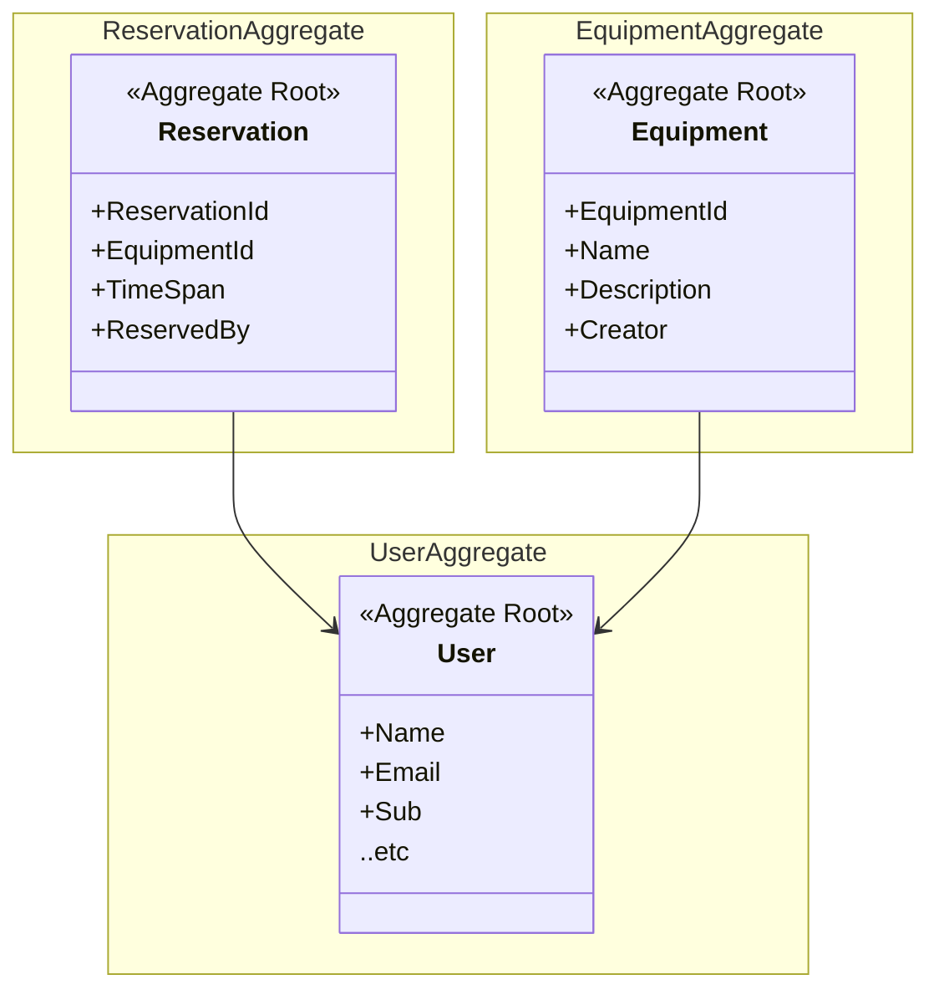

# Domain

Equipment reservation domain

## Subdomains

- Equipment domain
- Reservation domain
- Account domain

## Bounded Contexts

Same as subdomains:

### Equipment Context

Is responsible for managing equipment.

- Adding equipment to the system.
- Removing equipment from system.
- Handles information regarding equipment.

### Reservation Context

Is responsible for managing reservations.

- Reserving equipment.
- Cancelling reservation.
- Handles information regarding reservations.

### Account context

Is responsible for managing users.

- Authentication.
- Registration.
- Information management.

## Value Objects

- Time span
- Equipment status

## Entities

- Equipment
- Reservation
- Employee

## Aggregates

