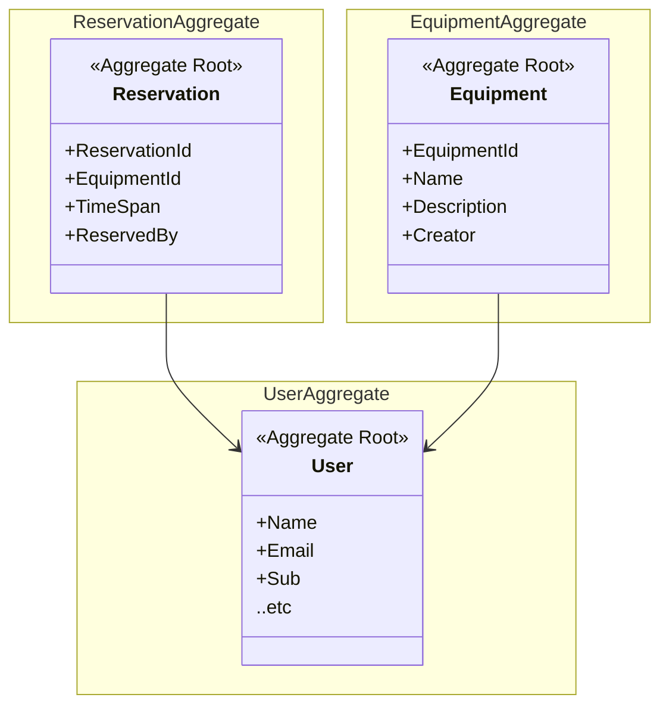

# Domain

Equipment reservation domain

# Subdomains

- Equipment domain
- Reservation domain
- Account domain

# Bounded Contexts

Same as subdomains:

- Equipment context
- Reservation context
- Account context

# Value Objects

- Time span
- Equipment status

# Entities

- Equipment
- Reservation
- Employee

# Aggregates

