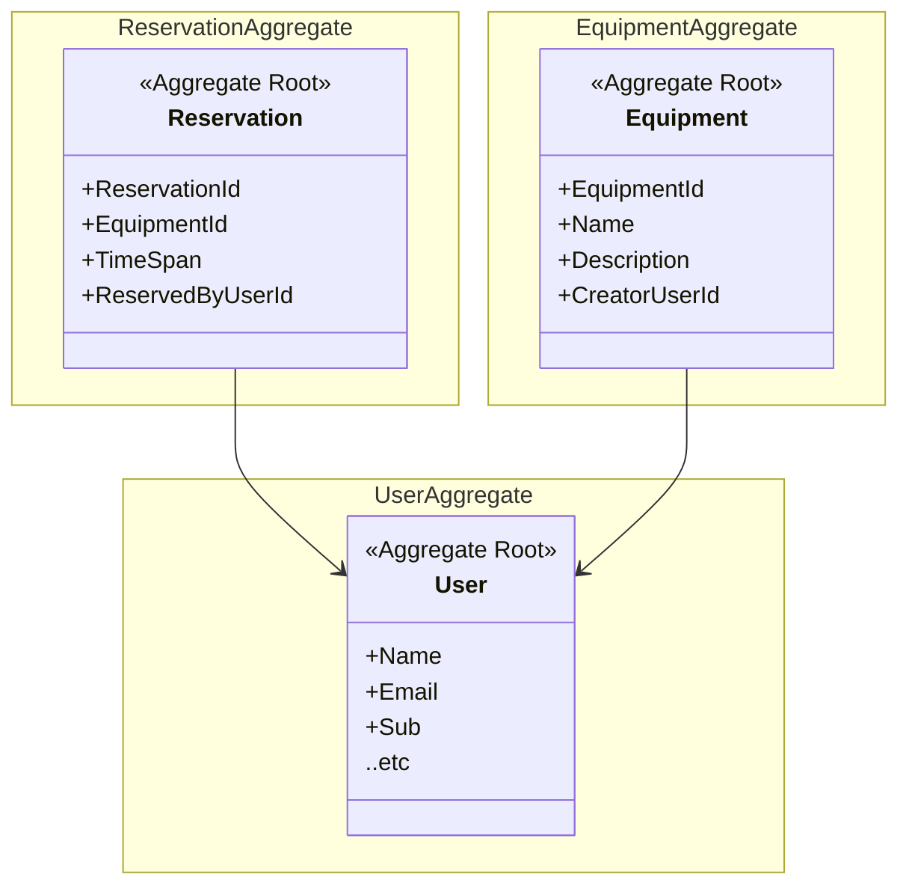

# Domain

Equipment reservation domain

## Subdomains

- Equipment domain
- Reservation domain
- Account domain

## Bounded Contexts

Same as subdomains:

- Equipment Context
- Reservation Context
- Account Context

## Microservices

### Inventory Service

Is responsible for equipment context.

- Equipment Availability
- Adding equipment to the system.
- Removing equipment from system.
- Handles information regarding equipment.

### Reservation Service

Is responsible for reservation context.

- Reserving equipment.
- Cancelling reservation.
- Handles information regarding reservations.

### Account Service

Is responsible for account context.

- Authentication.
- Registration.
- Information management.

## Value Objects

- Time span
- Equipment status

## Entities

- Equipment
- Reservation
- User

## Aggregates

