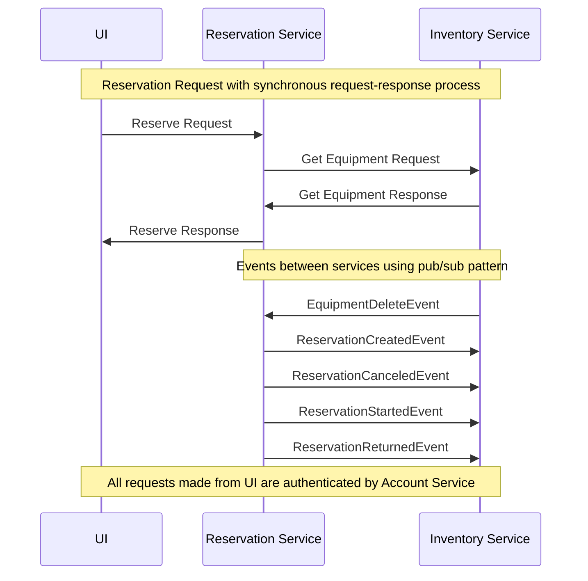

# Workflow

The system uses choreography and orchestration workflow patterns.





# Events

## EquipmentDeleteEvent

Published by: Inventory Service

Description: Equipment has been deleted from the system.

Schema: 

```json
{{EquipmentId}}
```

## ReservationCreatedEvent

Published by: Reservation Service

Description: Reservation was created in the system.

Schema:
```json
{
    ReservationId: Guid,
    EquipmentId: Guid
}
```


## ReservationCanceledEvent

Published by: Reservation Service

Description: Reservation was canceled.

Schema:
```json
{
    ReservationId: Guid,
    EquipmentId: Guid
}
```

## ReservationStartedEvent

Published by: Reservation Service

Description: Reservation was started.

Schema:
```json
{
    ReservationId: Guid,
    EquipmentId: Guid
}
```

## ReservationReturnedEvent

Published by: Reservation Service

Description: Equipment was returned after being used, completes the reservation.

Schema:
```json
{
    ReservationId: Guid,
    EquipmentId: Guid
}
```

