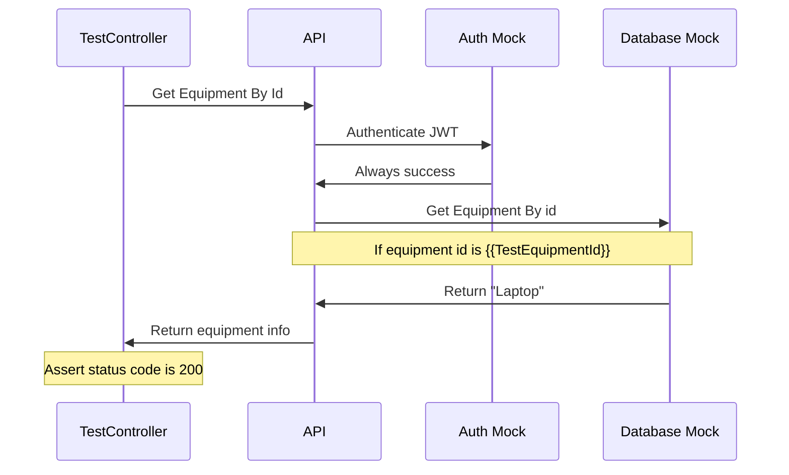

# Testing Plan

## Integration Tests

Integration tests are performed by `Inventory.Tests`.

It tests equipment REST APIs.

## Mocks and stubs

Database and OIDC providers are not available so they are mocked during testing.

Database access is handled using repository pattern and during testing this repository is mocked.

Mocked database has configured to return stubbed data when requesting equipment by test id.

Since REST API requires authentication they a mock authentication scheme is registered which will always succeed.

## Example of integration test with mocked database and authentication

