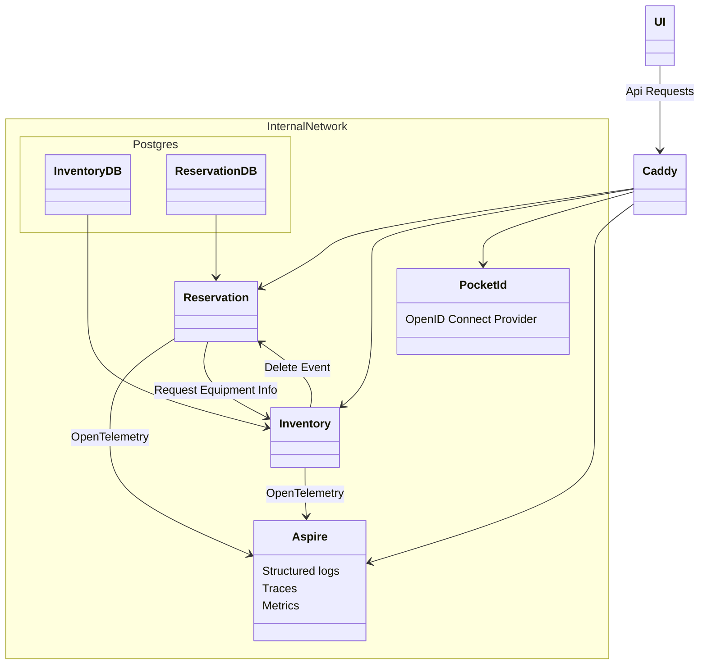

# Equipment Reservation System

## TODO:

- [x] Aspire dashboard
- [x] Jwt autentication for reservation
- [x] Save sub to database for equipment and reservation
- [ ] Finish docs
- [x] ask tutor about grading

## Checklist

- [x] Add database into your project. Maybe either Split Tables or Database View patterns could be good solutions here. (1p)
- [ ] Add widget-based fragmented UI as described in the material. (1p)
- [x] Add logging into the project microservices. (1p)
- [x] Add monitoring microservice with logs / events. (1p)
- [x] Implement Unit & Integration testing for your project. A demonstrative small set of test cases is ok. (1p)
  - Maybe needs a bit more
- [ ] Add testing microservice(s) to your system, with a set of test cases. No need to test the workflow thoroughly, just 1-2 selected services and possibly stub/mock-up services (1p)
- [ ] Implement end-to-end testing for your project. A demonstrative small set of test cases is ok. (1p)
- [ ] Add non-functional testing into your project. (1p)
- [x] Add authentication, security, failure recovery or such advanced feature into your project. (1-2p)
- [x] Use existing software framework & automation for some parts in your project. (1-2p)

## Diagram

