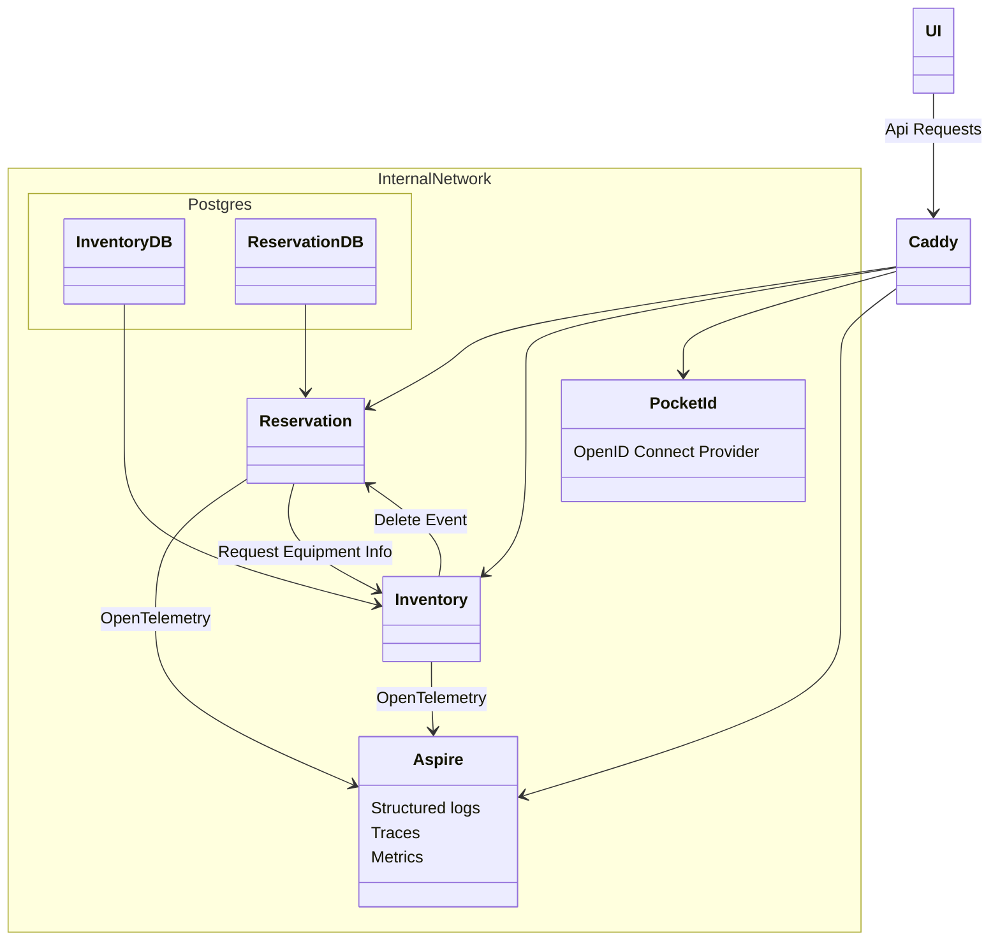

# Equipment Reservation System

## Diagram

```mermaid
classDiagram

  namespace InternalNetwork {
    class Reservation {
  
    }
    class Inventory {
  
    }
  
    class PocketId {
      OpenID Connect Provider
    }
  
    class Aspire {
      Structured logs
      Traces
      Metrics
    }

    namespace Postgres {
      class InventoryDB {
        
      }
      class ReservationDB
    }
  }


  class UI {

  }
  class Caddy {

  }

  UI --> Caddy : Api Requests

  Caddy --> Reservation
  Caddy --> Inventory
  Caddy --> PocketId
  Caddy --> Aspire

  Reservation --> Aspire : OpenTelemetry
  Inventory --> Aspire : OpenTelemetry

  Inventory --> Reservation : Delete Event
  Reservation --> Inventory : Request Equipment Info

  InventoryDB --> Inventory
  ReservationDB --> Reservation
  
```
