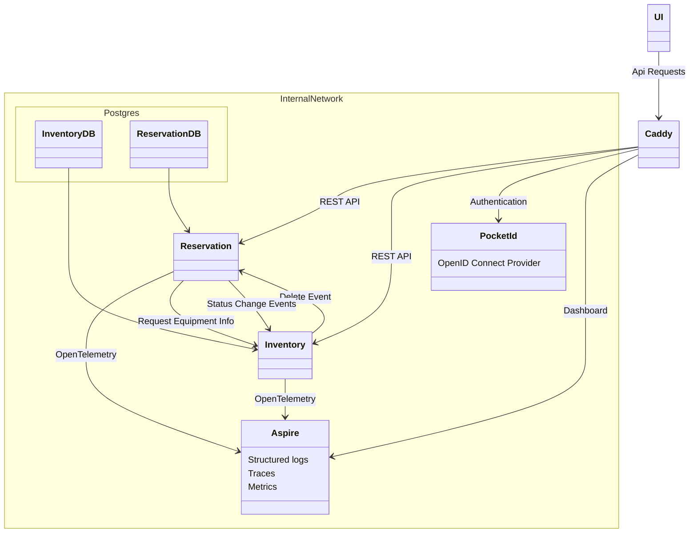

# Equipment Reservation System

## Links

- [Data communication structures](./Data-communication-structures.md)
- [DDD Documentation](./DDD-Document.md)
- [Testing Plan](./Testing-plan.md)

## Diagram

